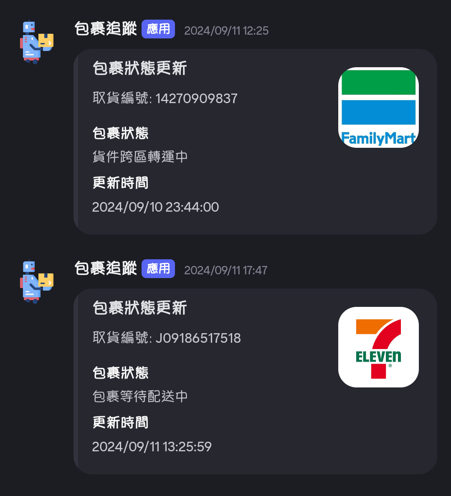

# parcel-track-bot

<p align="center">
    
</p>

A discord bot base on [parcel-tw](https://github.com/ryanycs/parcel-tw) to tracking the status of packages in Taiwan.

## Screenshots

<p align="center">
    
</p>

## Setup

```bash
# Clone the repository
git clone https://github.com/ryanycs/parcel-track-bot.git

# Docker build
docker build -t parcel-track-bot .

# Docker run
docker run -d --name parcel-track-bot
```

## Usage

### Commands

- `/track <platform> <order_id>`: Track the status of the package.
- `/subscribe <platform> <order_id>`: Subscribe the package and get the status update.
- `/unsubscribe <platform> <order_id>`: Unsubscribe the package.

## License

Distributed under the MIT License. See [LICENSE](LICENSE) for more information.